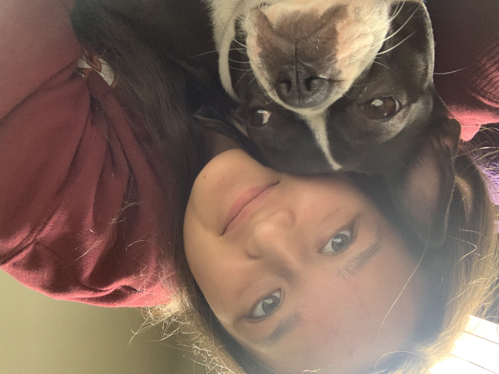

# Zoey Evans User Page


## Who I am as a Person


Here is a picture of me and my family's dog!

### Personal Description

I'm currently a second year Computer Engineering student in Marshall College at UCSD. I initially started out as a Computer Science major, but I switched to Computer Engineering because I realized that I was also interested in hardware! I'm from Ladera Ranch, which is located in the southern part of Orange County in California. I've been interested in science and technology from a young age, and have always been apart of robotics/engineering clubs and bootcamps since elementary school. 

Some things I like to do for fun are making custom keyboards, designing custom circuit boards, watching movies, and exploring San Diego (especially the cafes)! 

My main interests are in robotics and mechatronics, but I do enjoy coding and learning about new tools and programming languages! 

### Extracurriculars

I'm involved in a couple of clubs at UCSD. 

I'm currently the electrical lead for the [Yonder Dynamics](https://yonderdynamics.org/#/) robotics club, in which 

>we design and build a mars rover for the annual University Rover Challenge (URC), a prestigious international competition for college students.


Also, I'm currently a workshop officer for the [UCSD Keyboard club](https://www.ucsdkeebs.com/), in which I help put together workshops to show members how to build custom keyboard-related projects.   

## Who I am as a Programmer

I was taught how to code at a pretty young age, so I feel pretty comfortable with designing code and understanding code and how it works, regardless of what language it is. My main coding languages that I have experience with are **Java**, **C**, and **C++**. I grew up mainly using Java, but as I've gotten older, I feel like I've been gravitating more towards using C and C++. 

I would say my ranked coding language preferences (with 1 being the most preferred and 3 being the least preferred) are:

1. C++
2. C
3. Java

My [README.md file](README.md) also contains my favorite coding language!

I think my [academic experience](#academic-experience) at UCSD has helped me gain a lot more confidence coding in general by allowing me to get more comfortable using different coding languages and utilizing them in various applications. I don't have a whole lot of practical experience coding, as most of my coding experience has been more robotics related. 

### Academic Experience

The CSE classes that I have taken at UCSD so far are:

* CSE 11
* CSE 12
* CSE 20
* CSE 21
* CSE 29
* CSE 100

So I have a pretty good understanding of discrete mathematics and data structure concepts, and I have some experience coding with different languages through the PAs. 

### Practical Experience

Most of my practical experience with coding has been through clubs or sometimes internships.

I have a lot of experience using Arduino IDE to code Arduinos for club projects. For instance, in my [Yonder Dynamics](#extracurriculars) club, I utilized some Arduino IDE code to test a light sensor:

```
void setup() {
  Serial.begin(9600);
}

void loop() {
  // reads the input on analog pin A0
  int lightValue = analogRead(A0);

  // Print out the values to read in the Serial Monitor
  Serial.print("Analog reading (0-1023): ");
  Serial.print(lightValue);
  Serial.print("\n");
  delay(500);
  
}
```

I also have some limited experience using python to control lab equipment from a previous internship.

Overall, I would say that the areas of software engineering that I gravitate towards are:

- [x] Planning/Ideation 
- [x] Design
- [x] Implementation
- [ ] QA/Testing
- [ ] DevOps